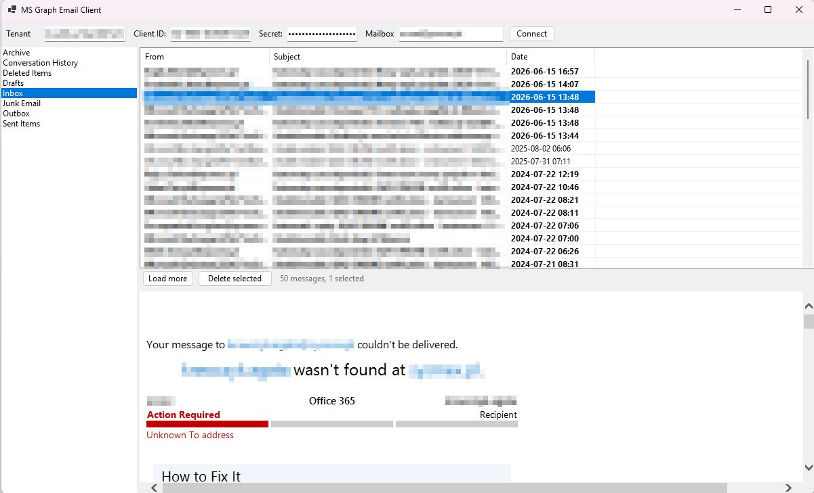

# MS Graph Email Client

A lightweight Windows desktop email viewer built on the Microsoft Graph API.

## Background

I had access to a mailbox only through the Graph API — no Outlook profile, no IMAP, just an Azure AD app registration with `Mail.ReadWrite` permission. I needed a simple tool to look through the emails and clean up some junk, so I built this.



## Features

- Browse mail folders (Inbox, Sent Items, Deleted Items, etc.)
- Read emails with full HTML rendering
- Load messages in pages of 50, with a **Load more** button and automatic scroll-to-bottom loading
- Multi-select messages and **Delete selected** using the Graph batch API (throttle-safe: 4 deletes per request with pacing between batches)

## Prerequisites

### Azure AD app registration

1. Register an application in [Entra ID](https://entra.microsoft.com)
2. Under **Certificates & secrets**, create a client secret and note its value
3. Under **API permissions**, add a **Microsoft Graph → Application permission**: `Mail.ReadWrite`
4. Click **Grant admin consent**
5. Note your **Tenant ID** and **Application (Client) ID**

The target mailbox must be in the same tenant as the app registration.

> **Application permission** (not Delegated) is required — the app authenticates as itself, not as a logged-in user.

## Usage

Fill in the four fields at the top and click **Connect**:

| Field | Where to find it |
|---|---|
| Tenant ID | Entra ID → Overview |
| Client ID | App registration → Overview → Application (client) ID |
| Secret | App registration → Certificates & secrets |
| Mailbox | The full email address of the mailbox to open |

Credentials are not saved between sessions.

## Tech stack

- C# / .NET 10 / Windows Forms
- [Microsoft.Graph](https://www.nuget.org/packages/Microsoft.Graph) 5.x — Graph API SDK
- [Azure.Identity](https://www.nuget.org/packages/Azure.Identity) 1.x — client credentials auth (`ClientSecretCredential`)

## Building

```bash
cd MsGraphEmailClient
dotnet build
dotnet run
```

Requires the [.NET 10 SDK](https://dotnet.microsoft.com/download) and Windows.
